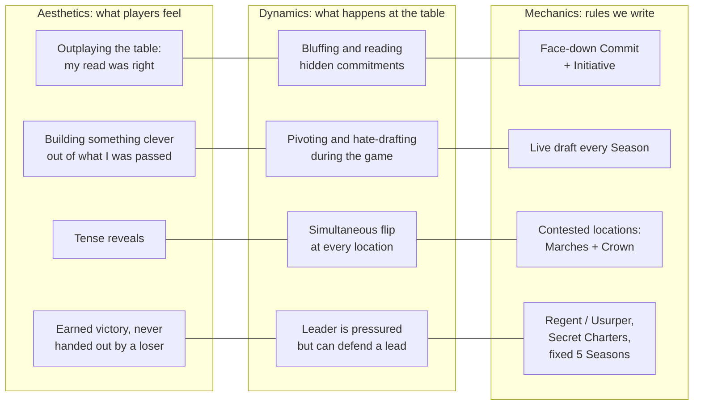
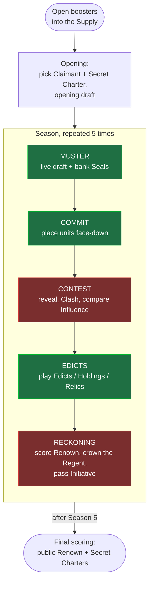
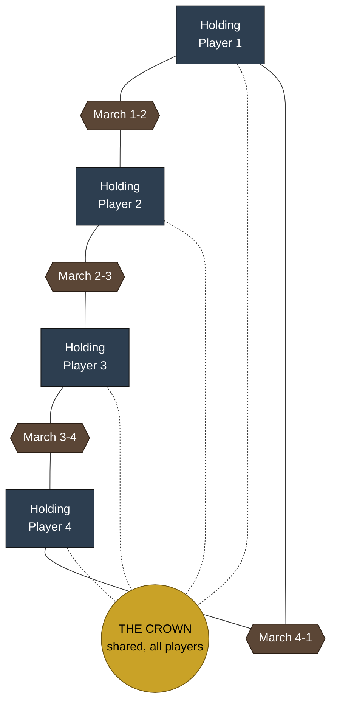

# Dark Charterlands: core gameplay loop (design draft v0.1)

> **Status:** first draft for review. Every mechanic below is a proposal to
> prototype and playtest, not a decision. Names (factions, zones, keywords) are
> placeholders. Each mechanic cites the research insights (I1-I20) in
> [`docs/research/tcg-design-research.md`](../research/tcg-design-research.md)
> that motivate it.

## 1. Expectations this design must meet

| # | Expectation | What it forces |
|---|---|---|
| E1 | **Hardcore, high depth** | Decisions must compound: drafting, positioning, timing and reading opponents. Little "auto-pilot". |
| E2 | **Booster draft first** | Opening boosters must be the normal way to play, not a side format. |
| E3 | **Multiplayer free-for-all (3-4+) first** | Must stay fun and fair at 3, 4 and 5+ players. Kingmaking and turtling must be designed against. |
| E4 | **Physical cards** | No hidden bookkeeping a computer would need to track. Every state is visible cards, tokens or face-down cards. |
| E5 | **20-40 minutes** | With 4 players, nobody can sit and wait through three other people's turns. |

E1 and E5 pull against each other: deep games are slow, and slow multiplayer games
are long. Most of this design exists to resolve that tension, by running thinking in
parallel (I11) and letting the draft carry depth (I5, I12).

## 2. The experience (MDA, starting from aesthetics)

Working backwards from feelings to rules (I2):



## 3. Setting hook (placeholder)

The old crown of the Charterlands is empty. Every region's royal charter is up
for grabs, and each player is a **Claimant** trying to gather enough **Renown**
to be acclaimed before the fifth Season ends. Location names below borrow from
the `charterlands-assets` region maps (Dunric High Crown, Salt Road, Thornwood,
Siltfen, ...). If those maps belong to a different project, swap the names; the
mechanics don't depend on them.

## 4. The core loop at a glance



<sub>Green = everyone acts at once. Red = resolved in order or per location.</sub>

**In one sentence:** every Season you draft from passing packs, secretly commit
units to your borders and the shared Crown, flip them all at once, win locations
with Influence, then build up your realm. After five Seasons, the most Renown wins.

## 5. Table layout (4 players)



- **Holding:** your home region. Units here are safe but score nothing. Holdings
  (buildings) attach here.
- **Marches:** one border location between each pair of neighbors, contested
  only by those two (I13). With *n* players there are *n* Marches, and they all
  resolve **in parallel**, so the game barely slows down as players are added.
- **The Crown:** one location everyone can contest. It is the table's shared
  focus and the built-in check on the leader (I13, I14). Each Season a
  **Charter card** is revealed on the Crown, changing its reward or rule for
  that Season. This adds variety without luck in your own draws (I1).

Scaling:
- **3 players:** everyone neighbors everyone (3 Marches).
- **5-6 players:** more Marches, still resolved in parallel.
- **2 players** (later): two Marches between the players plus the Crown.

## 6. Mechanics

### 6.1 Booster structure and the Supply (E2)
- Each player opens **2 boosters** (15 cards each). For 4 players that's 120 cards.
  All boosters are shuffled into a shared **Supply** (I12).
- Packs are formed from the Supply: one **pack of 12** per player.
- Every 2 Seasons, packs are **fully replaced** with fresh ones from the Supply, so
  drafting stays new and you don't pass the same leftovers forever (Algomancy).
- The same boosters still support a classic "draft, then build a deck" format
  later. The live draft is the priority format, but not the only one.

### 6.2 Opening (about 5 minutes)
1. Each player is dealt **2 Claimants** and keeps 1 (leader card: faction
   allegiance, a starting ability, and asymmetric starts).
2. Each player is dealt **2 Secret Charters** (hidden end-game objectives worth
   Renown) and keeps 1 (I3).
3. **Opening draft:** take cards from your first pack until 10 remain (5 cards),
   then pass. That is your starting hand.

### 6.3 Season phase 1: MUSTER (live draft; simultaneous)
- Combine **your hand with the pack in front of you**, then take cards until
  exactly **10 remain** in the pack. Pass it (left in odd Seasons, right in even).
  Any card in hand can be swapped back into a pack, so **no card is ever dead**
  (I1, I12; Algomancy).
- **Draft-matters cards** trigger here, with **Muster** abilities such as "When you
  draft this, look at the next pack" (Conspiracy, I12). They're tied to factions so
  they flow to the drafters who want them.
- **Bank Seals:** put up to **2 cards** from hand face-down under your Claimant as
  **Seals** of that card's faction. Seals are the resource: you tap them to pay
  costs and ability costs.
  - Because you choose what to bank, there's **no resource screw** (I1, I10).
  - **Commitment bonus:** when you bank a Seal of a faction you already have 3+ Seals
    of, also gain a neutral **Writ** (1 generic resource). This rewards focused
    drafting without forbidding pivots (Algomancy).

### 6.4 Season phase 2: COMMIT (simultaneous, hidden)
- Pay for units from hand by tapping Seals, and place them **face-down** at your
  Holding, either adjacent March, or the Crown. You may also Move units already in
  play, which costs 1.
- When everyone is done, **reveal all at once** (Snap / Sushi Go style). This is where
  bluffing, reading the table and sandbagging live (A1, E1).

### 6.5 Season phase 3: CONTEST (ordered)
Each location resolves on its own. All **Marches resolve in parallel**, then **the
Crown**.
1. **Clash** abilities trigger in **Initiative order**. The Initiative holder acts
   first, so they commit information first. This prevents standoffs (Algomancy).
2. Total each side's **Influence**. Highest Influence **claims** the location:
   - gain its **Renown**
   - trigger **Claim** abilities and the location's reward
3. **Ties: nobody claims.** That keeps things in balance, so no single play swings
   too much (I3, Pulsipher).
4. Units are never destroyed just by losing. Destruction comes only from card effects
   (I18: progress without elimination).

### 6.6 Season phase 4: EDICTS (simultaneous)
- Play non-unit cards **after** the Contest: **Edicts** (one-shot), **Holdings**
  (permanent engines at your Holding) and **Relics** (attach to units).
- Playing these *after* combat means plans made while drafting aren't wrecked
  mid-Season, and holding resources back no longer telegraphs a trick (Algomancy).

### 6.7 Season phase 5: RECKONING
- **Regent:** whoever claimed the Crown becomes the **Regent** (a stealable title,
  inspired by Monarch, I14). The benefit is **immediate**: take 1 Writ now, because
  delayed rewards just made Monarch holders turtle. The Regent also **takes
  Initiative**, so the leader commits information first next Season (I3).
- **Usurper:** claiming the Crown *from* the current Regent gives **+1 Renown**. This
  is a non-personal reason to attack the leader (Dethrone, I14).
- Untap everything and check the Season counter.

### 6.8 Winning
- The game ends after **Season 5**, a fixed end, so leader bashing can't drag it out
  (I16).
- Final score = public Renown + revealed **Secret Charter**. A hidden share of the
  score blurs who is really leading, which reduces leader bashing and makes
  kingmaking unreliable (I3).
- **No player elimination.** Everyone plays all five Seasons.
- Tiebreak: most Marches claimed, then the current Regent.

## 7. Cards

### 7.1 Card types

| Type | MetaZoo analog | Role |
|---|---|---|
| **Unit** | Creature | Influence on the board; Clash / Claim / Muster abilities |
| **Edict** | Strategy | One-shot effect in the Edicts phase |
| **Holding** | Terra | Permanent engine at your home Holding |
| **Relic** | Equipment | Attaches to a Unit |
| **Claimant** | Caster | Your leader: faction allegiance and an asymmetric start |
| **Charter** | (Mission) | Season card on the Crown; changes reward or rule |

### 7.2 Card anatomy (unit)

```
┌───────────────────────────────┐
│ Name                    Cost ◈│  ◈ = Seal cost (generic + faction pips)
│ Faction · Rarity              │
│ Traits: Beast, Warden         │  traits = synergy hooks (I20)
├───────────────────────────────┤
│ [art]                         │
├───────────────────────────────┤
│ Clash: …                      │  timing words: Muster / Clash / Claim
│ Claim: …                      │
├───────────────────────────────┤
│ Influence  ⬢ 4                │
└───────────────────────────────┘
```

### 7.3 Factions (5 → 10 draft archetypes)
**Five factions** give **ten two-faction pairs**: one draft archetype per pair, each
with a signpost uncommon (I15). Each faction owns **one or two signature verbs**,
following MetaZoo's clean Aura identities (I20). All names are placeholders.

| Faction | Signature verbs | Plays like | MetaZoo reference |
|---|---|---|---|
| **High Crown** | *Decree*, Initiative control | Order, taxes, manipulating turn order | Dark's Mission manipulation |
| **Salt Road** | *March* (move), Seal trading | Mobility; shows up where you aren't watching | Air's Move / Soar |
| **Thornwood** | *Duel*, big Influence | Wins head-on; Beasts | Earth's Duel / Overwhelm |
| **Siltfen** | *Withdraw* (bounce), hidden info | Deception, sandbagging, tricks | Water's Return |
| **Ashen** | *Blight* (−Influence counters), Sacrifice | Attrition, corrupting locations | Fire's Shatter + Dark's Hex |

About **5-6 keywords in total** at launch. Traits do most of the synergy work (I20).

### 7.4 Costing (start point, then playtest)
From MetaZoo's measured rate (I19), for units:
- **Vanilla Influence ≈ Cost + 1.5**
- **Each ability ≈ −1.5 to −2 Influence**, priced by how strong the ability is
- Power is gated by **cost and specialization, not rarity** (I4): efficient units
  at common, situational high-skill effects at rare.

Booster draft is the priority format, so the commons have to be strong and the
packs need to feel even.

## 8. Where the depth comes from (E1)

| Depth source | Decision |
|---|---|
| Live draft | Take for now, take for later, hate-draft, or bank as a Seal? (I5, I12) |
| Seal banking | Every Seal is a card you didn't keep, so pace and flexibility trade off (I10) |
| Hidden Commit | Where will each neighbor commit? Should I bluff the Crown? (A1) |
| Positioning | Holding vs two Marches vs Crown; Move costs make positions sticky |
| Initiative | Acting first can be a burden; manipulating it is a faction identity |
| Regent / Usurper | When to take the Crown, and when to let someone else hold the target |
| Secret Charter | Steering toward a hidden goal without revealing it |
| Synergy | Cards built for 2-3 card combinations, so depth grows faster than the card pool (Algomancy) |

## 9. Time budget (E5)

Estimates to verify in playtesting, 4 players:

| Step | Simultaneous? | Estimated time |
|---|---|---|
| Setup + opening boosters + Opening | partly | 5 min |
| Muster | yes | 2-3 min |
| Commit + reveal | yes | 1-2 min |
| Contest (Marches in parallel, then Crown) | per location | 1.5-2 min |
| Edicts | yes | 1 min |
| Reckoning | no | 0.5 min |
| **Per Season** | | **6-8.5 min** |
| **5 Seasons + setup** | | **≈ 35-48 min** |

The upper estimate runs over 40 minutes. Levers if playtests confirm it, in order of
preference:
1. Shrink the Muster (fewer swaps, pack of 10 → 8).
2. Drop to 4 Seasons.
3. Put a sand timer on the Muster.

Adding players adds mostly parallel work, so 5-6 players should cost only a few
minutes more.

## 10. How the design meets expectations

| Expectation | Met by | Risk |
|---|---|---|
| E1 Hardcore depth | Live draft, hidden Commit, positioning, Initiative, Regent politics, synergy design | Analysis paralysis in Muster |
| E2 Booster draft first | Boosters form the Supply; drafting is *every* Season | Logistics of passing packs on a crowded table |
| E3 FFA 3-4+ | Marches plus Crown, Regent / Usurper, Secret Charters, fixed end, no elimination | 3-player games where everyone neighbors everyone |
| E4 Physical | Only visible cards, face-down cards and a few tokens (Renown, Writs, Initiative, Regent) | Pack refills need table space |
| E5 20-40 min | Parallel Muster / Commit / Edicts; Marches resolve in parallel | Upper estimate is 48 min; see section 9 levers |

## 11. Traceability: mechanic → insight

| Mechanic | Insights |
|---|---|
| Live draft (Muster) | I1, I5, I11, I12 |
| Seals (banked cards) + commitment Writ | I1, I10 |
| Face-down Commit and simultaneous reveal | I9, I11 |
| Marches (neighbor-only) resolved in parallel | I11, I13 |
| The Crown + Charter cards | I1, I13 |
| Regent (immediate benefit) and Usurper bonus | I7, I14 |
| Secret Charters, fixed end, no elimination, ties claim nothing | I3, I16 |
| Edicts after Contest | I11 (Algomancy sequencing) |
| Influence instead of life totals | I18 |
| 5 factions → 10 archetypes, signature verbs | I15, I20 |
| Costing formula; power not gated by rarity | I4, I17, I19 |

## 12. Open questions for review
1. **Factions:** 5 (10 archetypes, cleaner draft) or 6 (matching MetaZoo's six Auras)?
2. **Secret Charters:** is about 15-20% of the score hidden the right amount, or does it
   make the game feel random to a hardcore audience?
3. **Units on the board:** do they stay in place between Seasons (more positional depth)
   or return home each Season (faster, simpler)?
4. **Distribution:** randomized boosters (needed for booster draft) versus Algomancy's
   complete-set model. Could we sell fixed "draft kits" that still feel like opening
   boosters (I17)?
5. **3-player balance:** with everyone neighboring everyone, does the Crown still matter?
6. **Theme:** do the `charterlands-assets` maps belong to this game?

## 13. Next steps
1. **Paper prototype:** about 120 placeholder cards (24 per faction plus neutrals),
   sleeved over proxies, with Renown, Writ, Initiative and Regent tokens.
2. **Playtest metrics** (log every game):
   - minutes per Season
   - final Renown spread
   - kingmaking incidents (did a non-contender decide the winner?)
   - how often the Regent changes hands
   - cards banked vs played
   - dead-turn reports
3. **Rules simulator:** a small script with random and greedy bots, to catch dominant
   strategies (for example, "always turtle the Crown") before human testing (de Mesentier
   Silva et al.).
4. Expand the research on resource systems (Sekula) and simultaneous-reveal design
   (Brode) before locking section 6.3.
